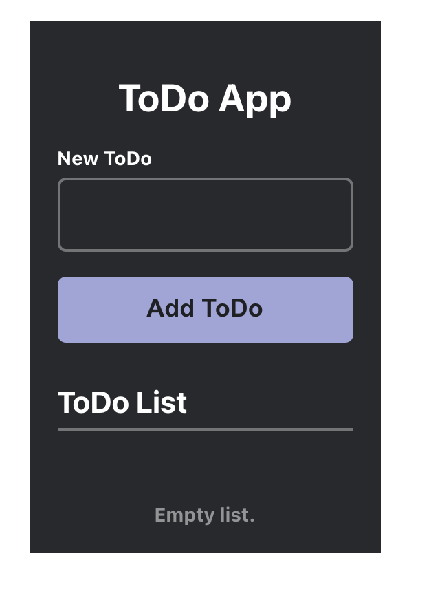
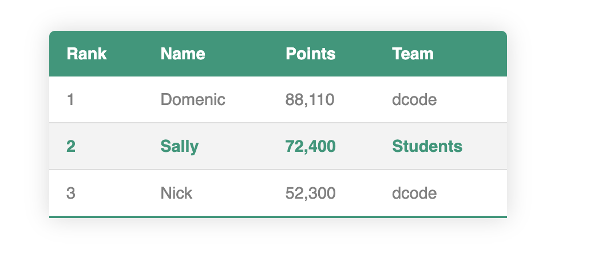
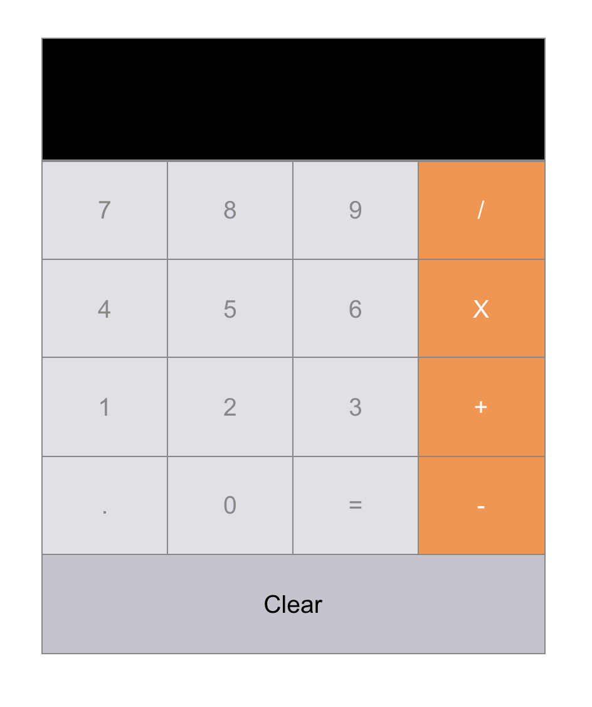
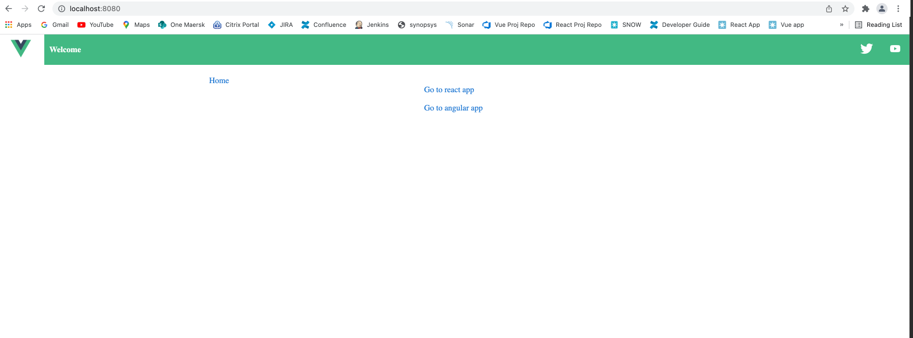
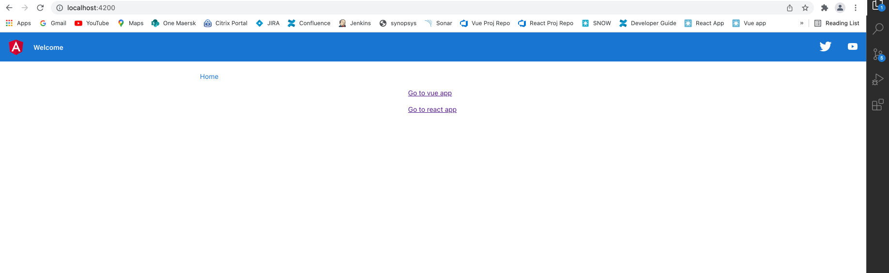
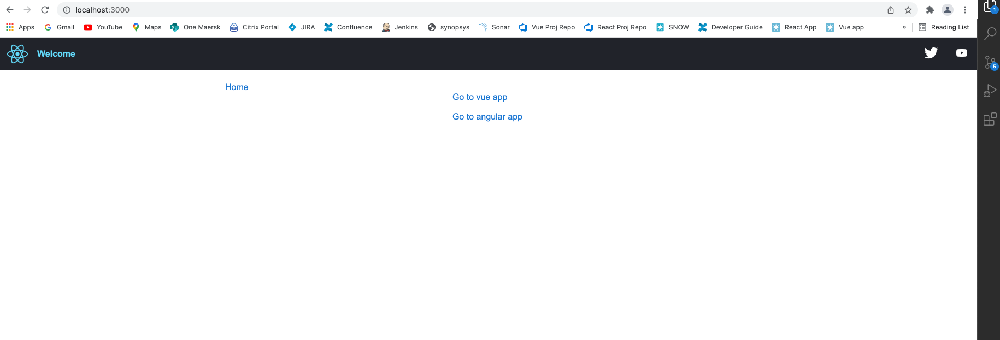
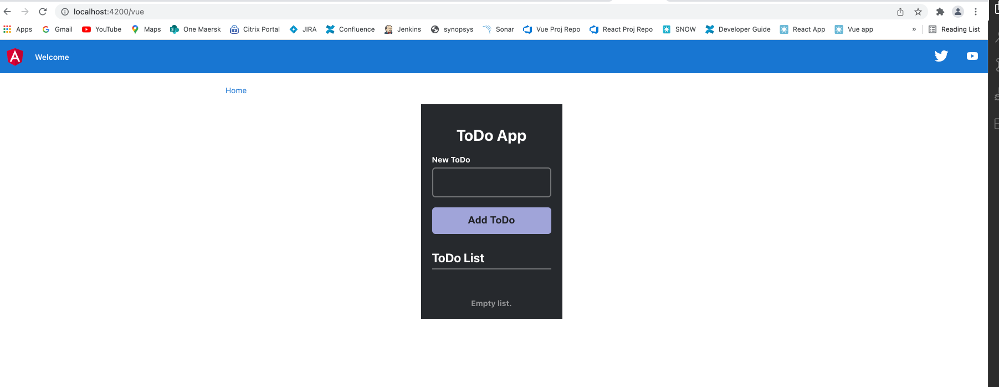
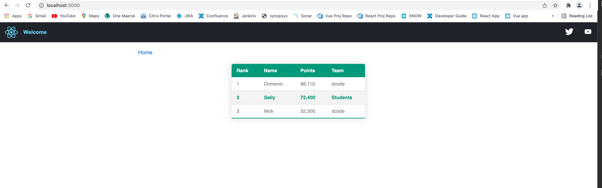
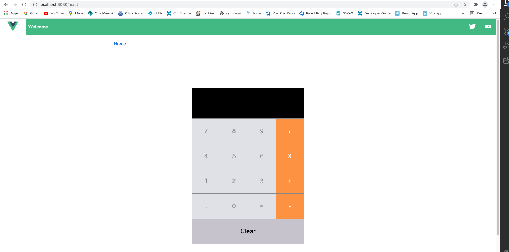

# Mod-Fed-Vue-Angular-React-two-way-binding
Module Federation example with two way binding

This has example of module sharing between 3 different UI frameworks. The loading of exposed components as micro app is done by the file src/bootloader.js found in each of apps.

There are 3 micro applications one in each app (All 3 apps are downloaded from internet. It is just for example)

1. A simple ToDo app implemented in Vue
2. A simple calculator app implemented in React 
3. A simple data table implemented in Angular

Screenshots of 3 micro apps

**Steps to run**

Open 3 terminals and run these coomands seperately

**Commands and localhost url**

| Angular                	| React                  	| Vue                    	|
|------------------------	|------------------------	|------------------------	|
| cd angular-app         	| cd react-app           	| cd vue-app             	|
| npm i                  	| npm i                  	| npm i                  	|
| npm start              	| npm start              	| npm start              	|
| http://localhost:4200/ 	| http://localhost:3000/ 	| http://localhost:8080/ 	|

**Result:**

